import { Tabs, TabItem, Aside } from '@astrojs/starlight/components';

<Aside type="caution" title="Notice">
This page was imported directly from the original wiki's backups. Only slight edits has been made.
</Aside>

<Aside type="danger" title="Outdated">
This page is outdated.
</Aside>

## Basic
<Aside title="Description">
Basic building parts. Can be positioned/shaped/rotated and can inhabit any color or material.
</Aside>

<Tabs>
<TabItem label='Block'>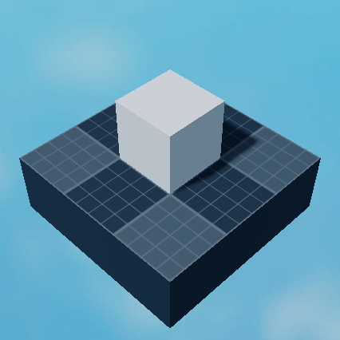</TabItem>
<TabItem label='Coil'>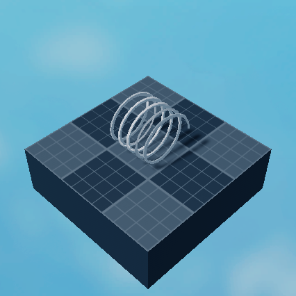</TabItem>
<TabItem label='Cone'>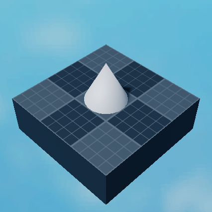</TabItem>
<TabItem label='Conical Frustrum'></TabItem>
<TabItem label='Corner Cylinder'>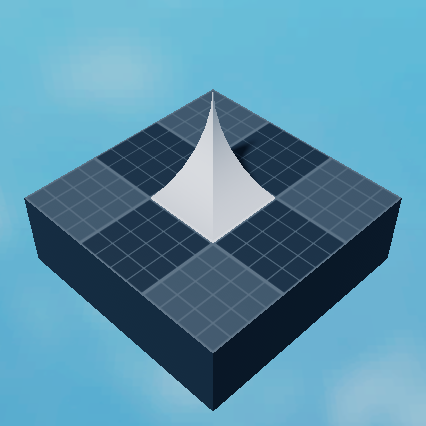</TabItem>
<TabItem label='Corner Cylinder 2'>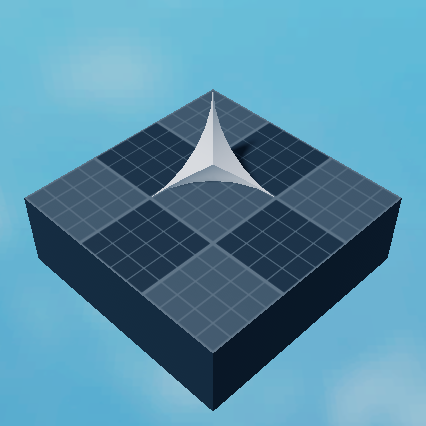</TabItem>
<TabItem label='Corner Wedge'>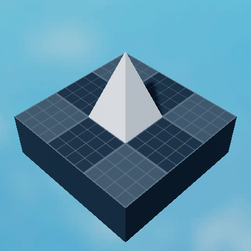</TabItem>
<TabItem label='Corner Wedge 2'>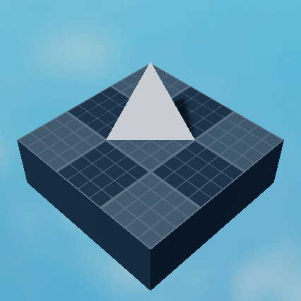</TabItem>
<TabItem label='Crystal'>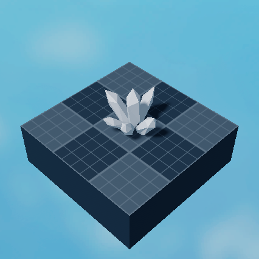</TabItem>
<TabItem label='Cube'></TabItem>
<TabItem label='Cylinder'>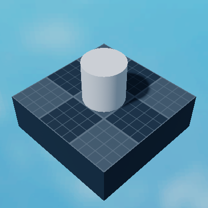</TabItem>
<TabItem label='Cylinder Cap'>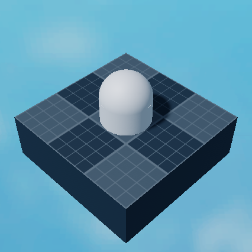</TabItem>
<TabItem label='Dodecahedron'>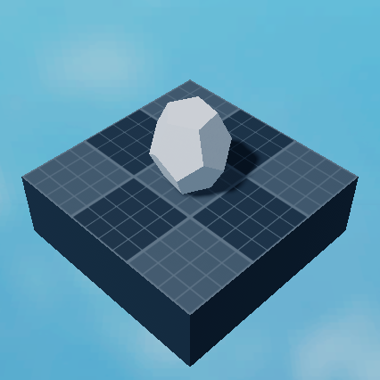</TabItem>
<TabItem label='Edge Sphere'>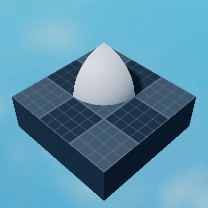</TabItem>
<TabItem label='Edge Wedge'>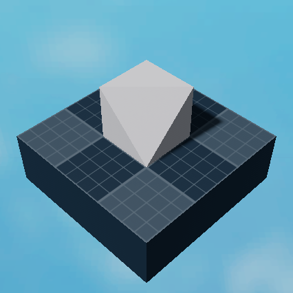</TabItem>
<TabItem label='Egg'>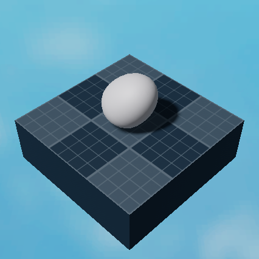</TabItem>
<TabItem label='Fence'>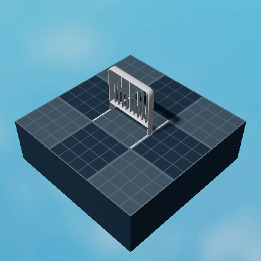</TabItem>
<TabItem label='Frustrum'>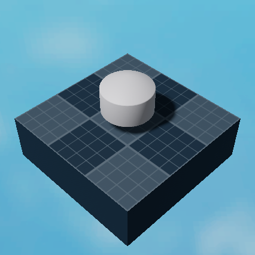</TabItem>
<TabItem label='Half Sphere'></TabItem>
<TabItem label='Head'></TabItem>
<TabItem label='Hexagon'></TabItem>
<TabItem label='Hexagon Ring'>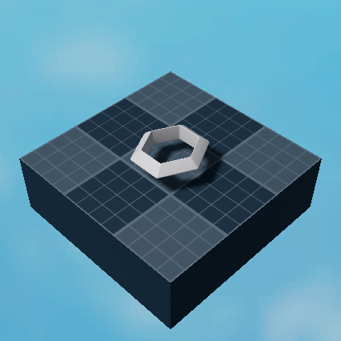</TabItem>
<TabItem label='Hexagonal Cone'>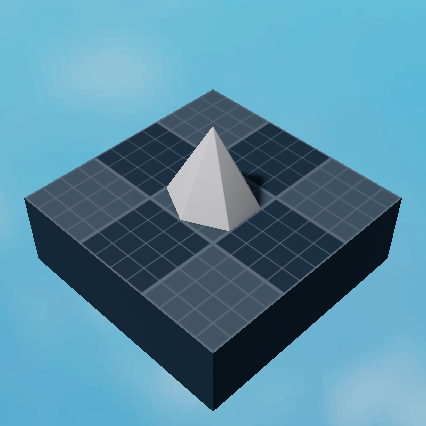</TabItem>
<TabItem label='Hollow Cylinder'>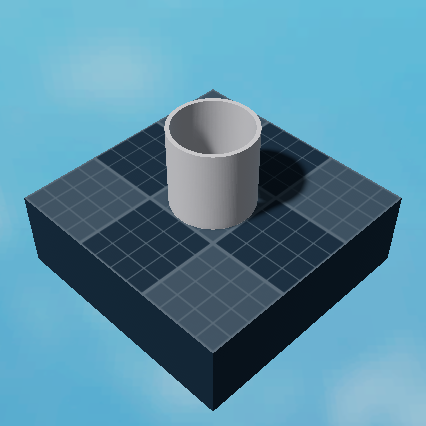</TabItem>
<TabItem label='Hollow Half Sphere'>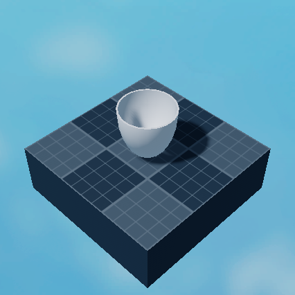</TabItem>
<TabItem label='Hollow Sphere'></TabItem>
<TabItem label='Ingot'>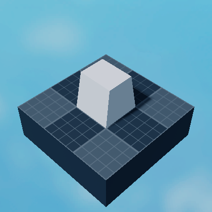</TabItem>
<TabItem label='Inverted Cylinder'>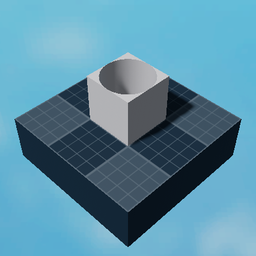</TabItem>
<TabItem label='Inverted Edge Sphere'>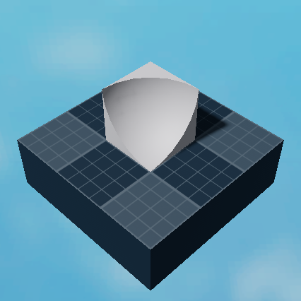</TabItem>
<TabItem label='Inverted Quarter Cylinder'>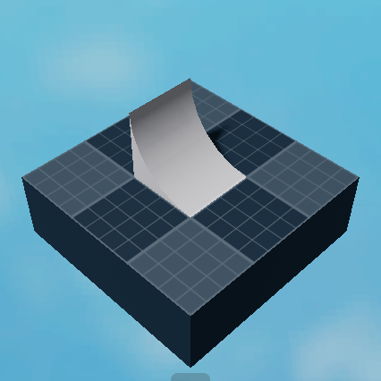</TabItem>
<TabItem label='Octagon'>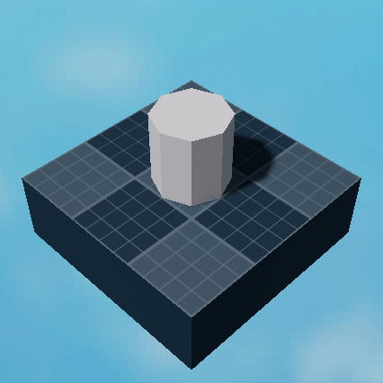</TabItem>
<TabItem label='Pentagon'>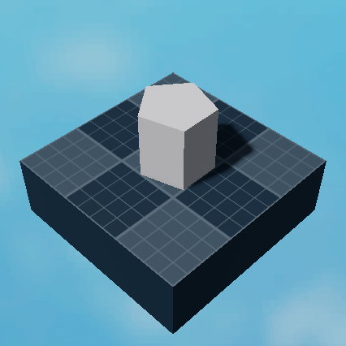</TabItem>
<TabItem label='Pentagon Ring'>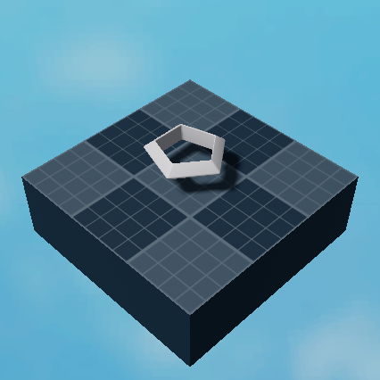</TabItem>
<TabItem label='Pentagonal Cone'></TabItem>
<TabItem label='Pyramid'>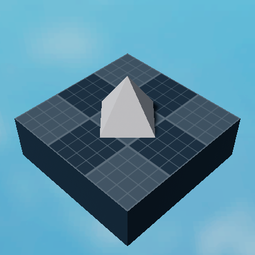</TabItem>
<TabItem label='Pyramidal Frustrum'>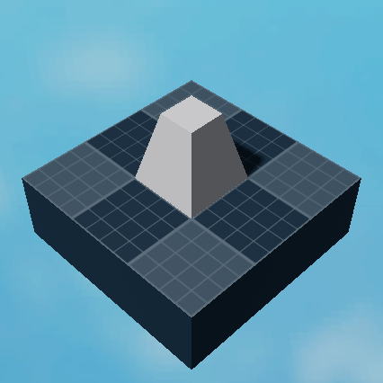</TabItem>
<TabItem label='Pyramidal Hexagon'>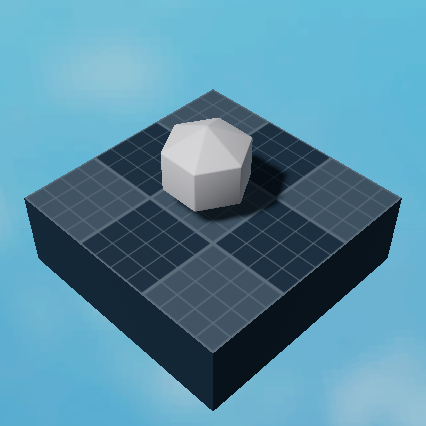</TabItem>
<TabItem label='Quarter Cylinder'>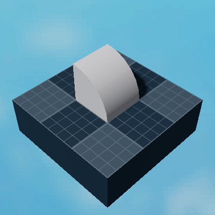</TabItem>
<TabItem label='Ring'>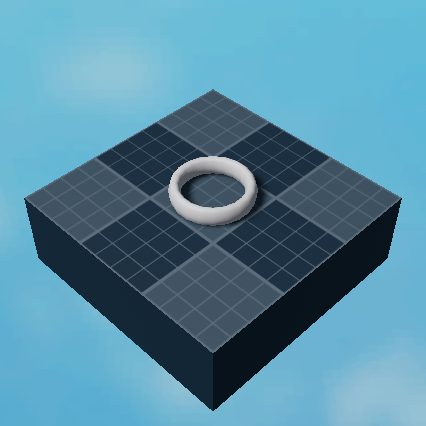</TabItem>
<TabItem label='Seat Block'>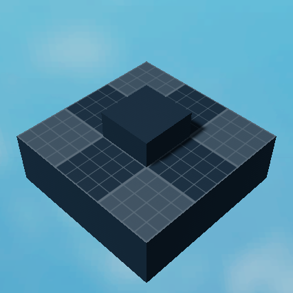</TabItem>
<TabItem label='Sphere'></TabItem>
<TabItem label='Spiked Cylinder'>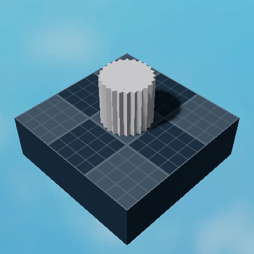</TabItem>
<TabItem label='Pyramid'>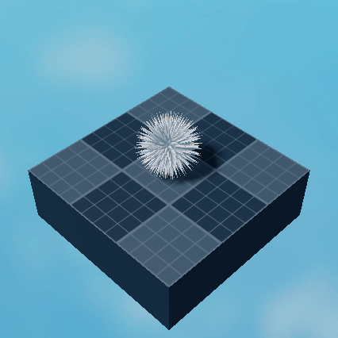</TabItem>
<TabItem label='Square Ring'>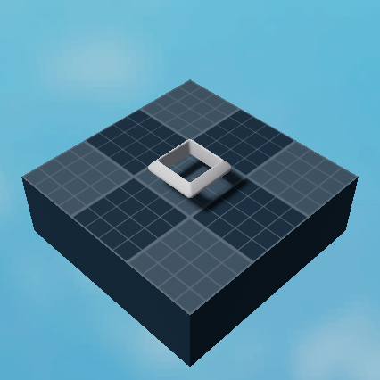</TabItem>
<TabItem label='Squashed Ring'></TabItem>
<TabItem label='Stairs'>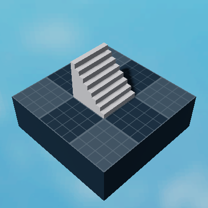</TabItem>
<TabItem label='Star'>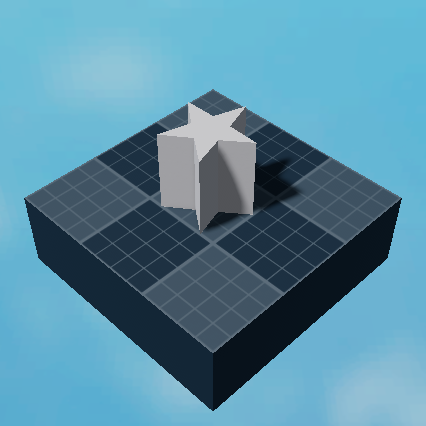</TabItem>
<TabItem label='Thick Hollow Cylinder'>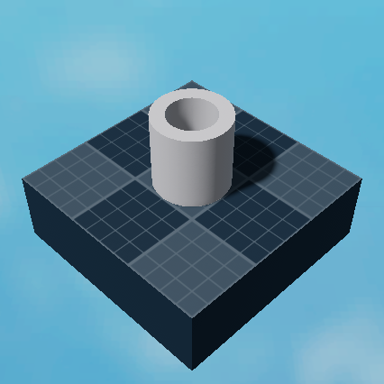</TabItem>
<TabItem label='Thin Hollow Cylinder'>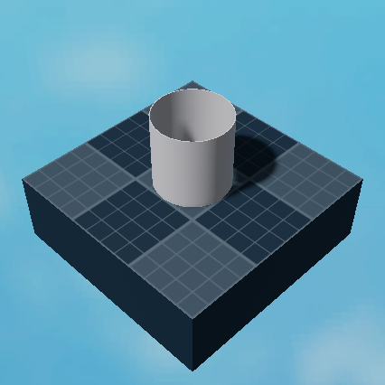</TabItem>
<TabItem label='Triangle'>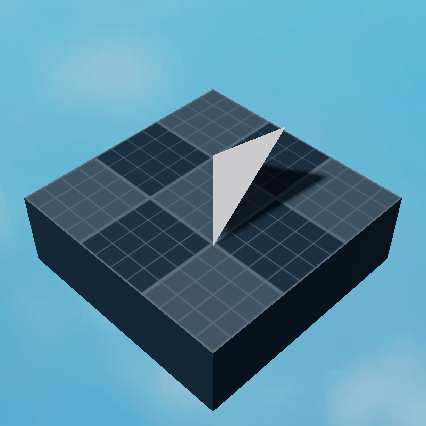</TabItem>
<TabItem label='Triangle Ring'>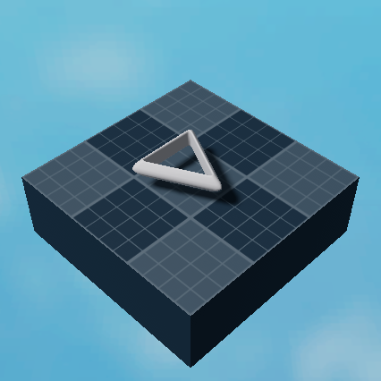</TabItem>
<TabItem label='Triangular Cone'></TabItem>
<TabItem label='Truss'>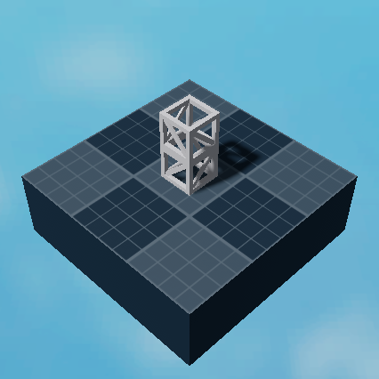</TabItem>
<TabItem label='Wedge'>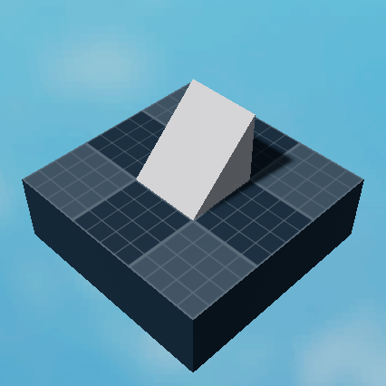</TabItem>
</Tabs>

## Special
<Aside title="Description">
Special parts have special behaviours.
</Aside>

<Tabs>
<TabItem label='Floating Text Block'>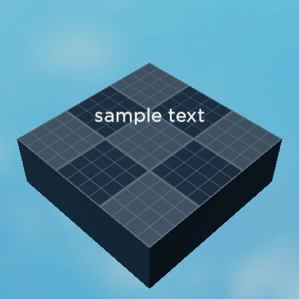</TabItem>
<TabItem label='Hinge Block'>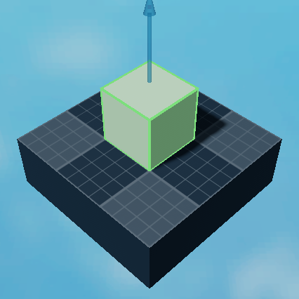</TabItem>
<TabItem label='Local Output Block'>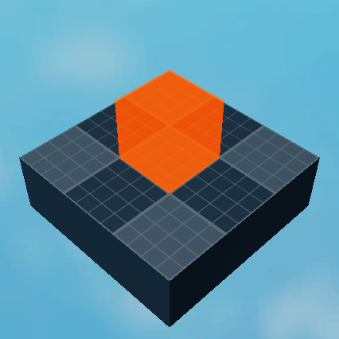</TabItem>
<TabItem label='Mesh Block'>This has a mesh applied! 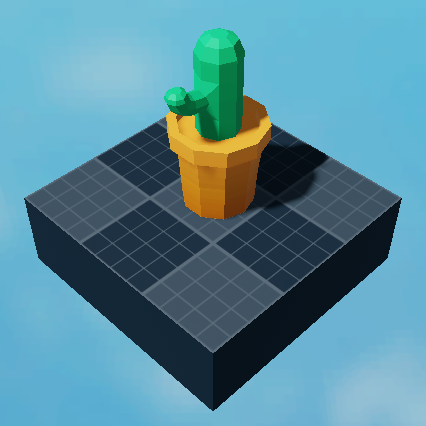</TabItem>
<TabItem label='Morph Block'>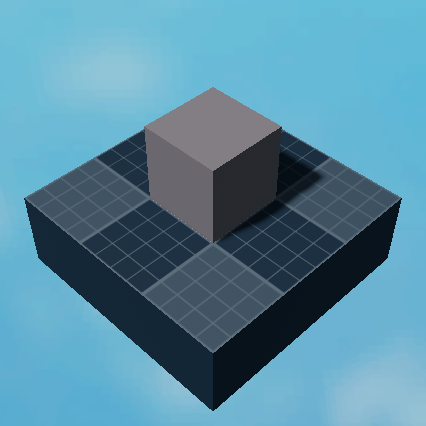</TabItem>
<TabItem label='Motor Block'></TabItem>
<TabItem label='NPC Block'>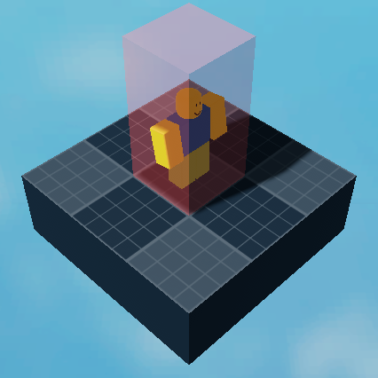</TabItem>
<TabItem label='Parallel Wiring Block'></TabItem>
<TabItem label='Servo Block'></TabItem>
<TabItem label='Sound Block'></TabItem>
<TabItem label='Hinge Block'></TabItem>
<TabItem label='Stat Block'></TabItem>
<TabItem label='Text Block'></TabItem>
<TabItem label='Seat Block'></TabItem>
<TabItem label='Hinge Block'></TabItem>
</Tabs>
