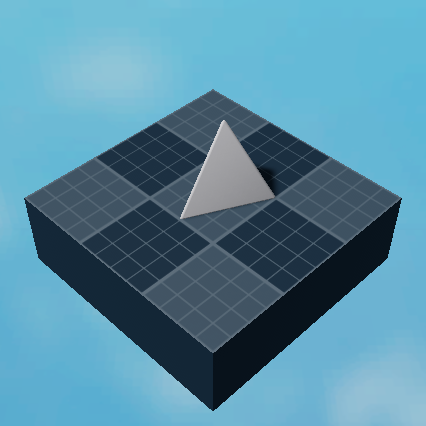

import { Card, LinkCard, Aside } from '@astrojs/starlight/components';

<Aside type="caution" title="Notice">
This page was imported directly from the original wiki's backups. Only slight edits has been made.
</Aside>

<Aside type="danger" title="Outdated">
This page is outdated.
</Aside>

## Basic
<Aside title="Description">
Basic building parts. Can be positioned/shaped/rotated and can inhabit any color or material.
</Aside>

| Block Name | Preview |
|-----|---------|
| Block |  |
| Cone |  |
| Corner Cylinder |  |
| Corner Cylinder 2 |  |
| Corner Wedge |  |
| Corner Wedge 2 |  |
| Cube |  |
| Cylinder |  |
| Cylinder Cap |  |
| Edge Sphere |  |
| Edge Wedge |  (funny name) |
| Half Sphere |  |
| Hexagon |  |
| Hollow Sphere |  |
| Inverted Cylinder |  |
| Inverted Edge Sphere |  |
| Inverted Quarter Cylinder |  |
| Dodecahedron |  (will fix the bg inconsistency soon)| 
| Egg |  |
| Fence |  |
| Frustrum |  |
| Head |  |
| Hexagon Ring |  |
| Hexagonal Cone |  |
| Hollow Cylinder |  |
| Octagon |  |
| Pyramid |  |
| Pyramidal Hexagon |  |
| Quarter Cylinder |  |
| Pentagon |  |
| Pentagon Ring |  |
| Pentagonal Cone |  |
| Ring |  |
| Seat Block |  |
| Sphere |  |
| Spiked Cylinder |  |
| Square Ring |  |
| Squashed Ring |  |
| Stairs |  |
| Star |  |
| Thick Hollow Cylinder |  |
| Thin Hollow Cylinder |  |
| Triangle |  |
| Triangle Ring |  |
| Triangular Cone |  |
| Truss |  |
| Wedge |  |

## Special
<Aside title="Description">
Special parts have special behaviours.
</Aside>

| Block Name | Preview |
|-----|---------|
| Text Block |  |
| Vehicle Seat |  |
| NPC Block |  |