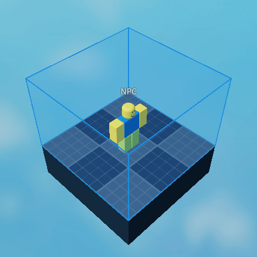
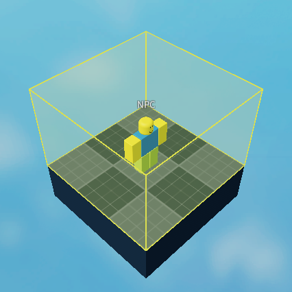
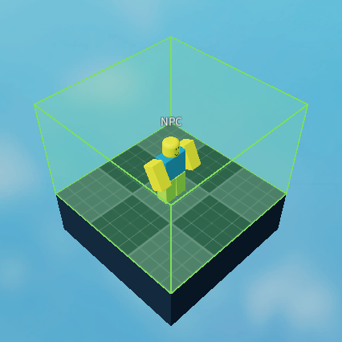
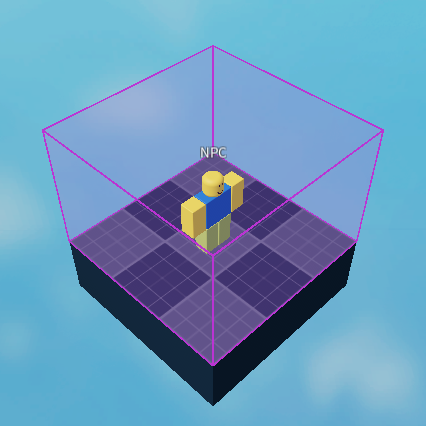

import { Picture } from 'astro:assets';
import { Aside, Tabs, TabItem } from '@astrojs/starlight/components';

<Aside type="caution" title="Notice">
This page was imported directly from the original wiki's backups. Only slight edits has been made.
</Aside>

<Aside type="danger" title="Outdated">
This page is outdated.
</Aside>

There are currently **6 types** of zones in Wubby, and 4 types of actions that can be done on said zones.

We will go in-depth on each and every one of these.

<Tabs>
    <TabItem label="Build Zone">
        The build zone allows you to **whitelist specific users** so they can **build in the area.** \
        You cannot build outside the area.

        <Aside title="Tip">
        This can be useful for plot building games or allowing users to edit specific parts of your world.
        </Aside>

        
    </TabItem>
    <TabItem label="Sound Zone">
        The sound zone allows you to play any sounds in specific regions, and only inside that region. \
        If anyone enters the area, they will hear the sound, until they go outside.\
        You can change the playback speed and the volume, which essentially allows you to speed up or slow down the song, and louden it or quieten it. 

        <Aside title="Tip">
        This zone can be used for ambience in areas, a forest or a sewer, for example.
        </Aside>

        
    </TabItem>
    <TabItem label="Safe Zone">
        A Safe Zone is a zone that gives the Player a forcefield while the Player is inside it.

        <Aside title="Tip">
        This can be useful for lobbies, and safe zones for fighting games.
        </Aside>

        
        
    </TabItem>
    <TabItem label="Physics Zone">
        A Physics Zone is a zone that affects the **physics of Players** that are inside it. 

        <Aside title="Tip">
        You can use this for:
        - Low gravity zones (like space)
        - High gravity zones
        - Normal gravity zones
        - etc
        </Aside>

        
        
    </TabItem>
</Tabs>